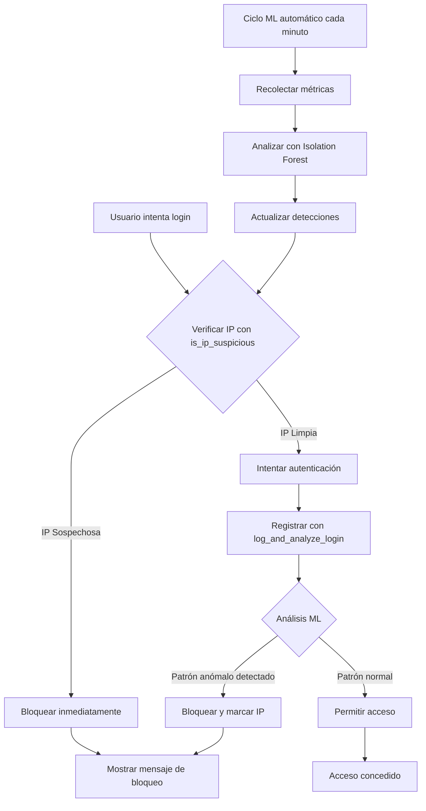

# ML Anomaly Detection System

## Descripción General

Sistema de detección de anomalías basado en Machine Learning que utiliza el algoritmo **Isolation Forest** para identificar automáticamente intentos de inicio de sesión sospechosos y ataques de fuerza bruta, **reemplazando completamente el sistema tradicional de Exponential Backoff**.

## ✨ Cambio Principal: ML en lugar de Exponential Backoff

Este sistema implementa una defensa proactiva y adaptativa contra ataques de fuerza bruta mediante:

- **Detección en tiempo real**: Analiza cada intento de login antes de permitir el acceso
- **Bloqueo inteligente**: Bloquea automáticamente IPs con patrones anómalos
- **Sin retardos artificiales**: No impacta la experiencia de usuarios legítimos
- **Aprendizaje continuo**: El modelo mejora con cada nueva muestra de datos

### Comparación: Exponential Backoff vs ML

| Característica | Exponential Backoff | Isolation Forest ML |
|----------------|---------------------|---------------------|
| Detección | Reactiva (después de X fallos) | Proactiva (analiza patrones) |
| Impacto en usuarios legítimos | Alto (esperas crecientes) | Bajo (solo bloquea anomalías) |
| Adaptabilidad | Fija | Adaptativa |
| Precisión | Baja (cuenta intentos) | Alta (analiza comportamiento) |
| Falsos positivos | Frecuentes | Mínimos |

## Algoritmo: Isolation Forest

### ¿Qué es Isolation Forest?

Isolation Forest es un algoritmo de detección de anomalías no supervisado que aísla observaciones anómalas en lugar de perfilar observaciones normales. Se basa en el principio de que las anomalías son "pocos y diferentes", por lo que son más fáciles de aislar que los puntos normales.

### ¿Cómo Funciona?

1. **Construcción de Árboles**: El algoritmo construye múltiples árboles de aislamiento (Isolation Trees) mediante:
   - Selección aleatoria de una característica
   - Selección aleatoria de un valor de división entre el mínimo y máximo de esa característica
   - Recursivamente dividiendo los datos hasta que cada punto esté aislado

2. **Puntuación de Anomalía**: 
   - Puntos anómalos requieren menos divisiones para ser aislados (menor profundidad del árbol)
   - Puntos normales requieren más divisiones (mayor profundidad)
   - La puntuación de anomalía se calcula como: `score = 2^(-E(h(x))/c(n))`
   - Donde E(h(x)) es la longitud promedio del camino y c(n) es una función de normalización

3. **Detección**:
   - Score > 0.5: Probable anomalía
   - Score ≈ 0.5: Comportamiento normal
   - Score < 0.5: Definitivamente normal

## Comportamiento Detectado

### Comportamiento Normal (1-9 intentos/minuto)
- Usuarios legítimos
- Credenciales válidas con algunos errores ocasionales
- Tasa de éxito: 80-95%
- Intervalos regulares entre intentos
- Pocos emails únicos probados

### Comportamiento Anómalo (10-150 intentos/minuto)
- Ataques de fuerza bruta
- Diccionarios de contraseñas (similar a Nmap)
- Tasa de éxito: ~5%
- Intervalos muy cortos entre intentos
- Múltiples emails diferentes probados
- Patrones de ataque automatizados

## Métricas Recolectadas

El sistema recolecta las siguientes métricas por IP en ventanas de 1 minuto:

1. **Requests por minuto**: Velocidad de intentos de login
2. **Ratio de errores**: Porcentaje de intentos fallidos
3. **Tiempo promedio entre requests**: Intervalos entre intentos
4. **Tiempo mínimo entre requests**: Intervalo más corto
5. **Tiempo máximo entre requests**: Intervalo más largo
6. **Emails únicos probados**: Cantidad de diferentes emails intentados

## Arquitectura del Sistema

### Flujo de Autenticación con ML



### Base de Datos

#### Tabla `ip_metrics`
Almacena métricas calculadas por IP en ventanas de tiempo:
```sql
- ip_address: INET
- window_start: TIMESTAMP
- window_end: TIMESTAMP
- requests_per_minute: INTEGER
- failed_attempts: INTEGER
- success_attempts: INTEGER
- error_ratio: NUMERIC
- avg_time_between_requests: NUMERIC
- unique_emails_tried: INTEGER
```

#### Tabla `anomaly_detections`
Registra detecciones de anomalías:
```sql
- ip_address: INET
- detected_at: TIMESTAMP
- anomaly_score: NUMERIC (0-1)
- is_anomaly: BOOLEAN
- metrics: JSONB
- status: TEXT (active, resolved, false_positive)
```

#### Tabla `ml_model_state`
Guarda el estado del modelo entrenado:
```sql
- model_type: TEXT
- training_data: JSONB
- parameters: JSONB
- trained_at: TIMESTAMP
- is_active: BOOLEAN
```

### Edge Functions

#### `ml-anomaly-detection`
Función principal que maneja el ciclo de ML:

**Acciones disponibles:**

1. **`collect_metrics`**: Recolecta métricas de los últimos 60 segundos
   ```json
   { "action": "collect_metrics" }
   ```

2. **`train_model`**: Entrena el modelo Isolation Forest con datos históricos
   ```json
   { "action": "train_model" }
   ```

3. **`detect_anomalies`**: Ejecuta detección en métricas recientes
   ```json
   { "action": "detect_anomalies" }
   ```

4. **`full_cycle`**: Ejecuta recolección, entrenamiento (si es necesario) y detección
   ```json
   { "action": "full_cycle" }
   ```

### Funciones de Base de Datos (Nuevas)

#### `is_ip_suspicious(_ip_address inet)`
Verifica si una IP está marcada como sospechosa basándose en detecciones ML recientes (últimos 15 minutos).

**Retorna:**
```sql
TABLE(
  is_suspicious boolean,
  anomaly_score numeric,
  reason text
)
```

**Uso en autenticación:**
- Se ejecuta ANTES de cada intento de login
- Bloquea inmediatamente IPs con anomalías activas
- Reemplaza la función `get_backoff_delay` (deprecada)

#### `log_and_analyze_login(_ip_address inet, _email text, _success boolean, _user_agent text)`
Registra un intento de login y ejecuta análisis ML en tiempo real.

**Retorna:**
```sql
TABLE(
  allowed boolean,
  reason text,
  anomaly_score numeric
)
```

**Comportamiento:**
1. Verifica si la IP ya está bloqueada
2. Registra el intento en `login_attempts`
3. Si es un intento fallido de IP sospechosa, bloquea inmediatamente
4. Para intentos exitosos, siempre permite el acceso
5. Para intentos fallidos de IPs limpias, verifica nuevamente el estado

#### `cleanup_old_detections()`
Función de mantenimiento que:
- Marca como "resolved" las detecciones de más de 24 horas
- Elimina métricas de más de 7 días
- Debe ejecutarse periódicamente (recomendado: cada 24 horas)

#### `generate-test-data`
Genera datos sintéticos para entrenamiento y pruebas:

**Modos disponibles:**

1. **`normal`**: Genera comportamiento normal de usuarios
   ```json
   { "count": 100, "mode": "normal" }
   ```

2. **`attack`**: Genera comportamiento de ataque
   ```json
   { "count": 50, "mode": "attack" }
   ```

3. **`mixed`**: Genera tráfico mixto (70% normal, 30% ataques)
   ```json
   { "count": 200, "mode": "mixed" }
   ```

## Dashboard

### Pestañas Principales

1. **Overview**: Vista general con gráficos de actividad
   - Gráfico de intentos exitosos vs fallidos
   - Tarjetas de resumen con métricas clave
   - Lista de anomalías recientes

2. **Suspicious IPs**: Top 10 IPs sospechosas
   - Ranking por frecuencia y severidad de anomalías
   - Puntuación promedio de anomalía
   - Total de intentos fallidos
   - Última detección

3. **IP Details**: Análisis detallado por IP
   - Gráficos de comportamiento temporal
   - Historial de detecciones de anomalías
   - Métricas específicas de la IP

4. **Test Data**: Generador de datos de prueba
   - Botones para generar diferentes volúmenes de datos
   - Guía de uso paso a paso
   - Descripción de patrones generados

## Guía de Uso

### 1. Generación de Datos de Entrenamiento

1. Ir a la pestaña "ML Detection" en el dashboard
2. Seleccionar la pestaña "Test Data"
3. Generar datos de entrenamiento:
   - **Primero**: 200 intentos normales para establecer línea base
   - **Segundo**: 20-50 ataques para enseñar patrones anómalos
   - **Opcional**: 200 intentos mixtos para datos más realistas

### 2. Entrenamiento del Modelo

1. Hacer clic en el botón "Train Model" en la parte superior
2. El sistema:
   - Recupera hasta 1000 muestras históricas
   - Normaliza las características
   - Entrena 100 árboles de Isolation Forest
   - Guarda el estado del modelo

**Nota**: Se requieren al menos 10 muestras para entrenar el modelo.

### 3. Detección de Anomalías

#### Detección Manual
1. Hacer clic en "Run Detection"
2. El sistema:
   - Recolecta métricas del último minuto
   - Evalúa cada IP contra el modelo entrenado
   - Guarda detecciones en la base de datos
   - Actualiza el dashboard

#### Detección Automática (Recomendado)
Para ejecutar detección cada minuto, configurar un cron job o scheduler que llame:
```typescript
supabase.functions.invoke('ml-anomaly-detection', {
  body: { action: 'full_cycle' }
})
```

### 4. Monitoreo

- El dashboard se actualiza automáticamente cada minuto
- Revisar la pestaña "Overview" para tendencias generales
- Revisar "Suspicious IPs" para IPs que requieren atención
- Usar "IP Details" para investigación profunda

## Implementación del Algoritmo

### Parámetros del Modelo

```typescript
const forest = new IsolationForest(
  numTrees: 100,        // Número de árboles en el bosque
  sampleSize: 256       // Tamaño de muestra para cada árbol
);
```

### Normalización de Características

Las características se normalizan antes del entrenamiento:

```typescript
const normalizedFeatures = [
  requests_per_minute / 100,  // 0-1.5 range (max 150)
  error_ratio,                 // 0-1 range (ya es ratio)
  avg_time_between_requests / 60,  // 0-1 range (en minutos)
  unique_emails_tried / 50     // 0-1 range aprox.
];
```

### Umbral de Detección

```typescript
const threshold = 0.6;  // Puntuación > 0.6 indica anomalía
```

Este umbral puede ajustarse según las necesidades:
- **0.5-0.6**: Más sensible, más falsos positivos
- **0.6-0.7**: Balance recomendado
- **0.7-0.8**: Menos sensible, solo anomalías muy claras

## Métricas del Dashboard

### Tarjetas de Resumen

1. **Active Anomalies**: Número de IPs actualmente marcadas como sospechosas
2. **Total Requests**: Total de intentos de login en el período monitoreado
3. **Avg Error Ratio**: Porcentaje promedio de intentos fallidos
4. **Monitored IPs**: Número de IPs únicas siendo monitoreadas

### Gráficos

1. **Login Attempts Over Time**: Barras apiladas mostrando intentos exitosos vs fallidos
2. **IP-Specific Metrics**: Línea temporal de requests/minuto por IP seleccionada

## Mejores Prácticas

### Para Entrenamiento
- Usar al menos 100 muestras de comportamiento normal
- Incluir al menos 20 ejemplos de ataques
- Re-entrenar el modelo semanalmente con datos recientes
- Mantener un balance 70/30 entre datos normales y anómalos

### Para Detección
- Ejecutar detección cada minuto para tiempo real
- Revisar anomalías diariamente
- Marcar falsos positivos para mejorar el modelo
- Mantener un log de IPs bloqueadas

### Para Rendimiento
- Limitar consultas históricas a las últimas 1000 muestras
- Usar índices en las columnas ip_address y timestamp
- Archivar detecciones antiguas después de 30 días
- Monitorear el tiempo de ejecución de las edge functions

## Seguridad y RLS

Todas las tablas tienen Row Level Security (RLS) habilitado:

- **ip_metrics**: Solo super admins pueden ver métricas
- **anomaly_detections**: Solo super admins pueden ver y actualizar
- **ml_model_state**: Solo super admins pueden ver modelos

El sistema puede insertar datos sin autenticación (para logging automático).

## Limitaciones Conocidas

1. **IP Address**: Actualmente usa placeholder '127.0.0.1' desde el cliente
   - Solución: Implementar detección de IP en el backend
   
2. **Modelo en Memoria**: El modelo no persiste entre ejecuciones
   - Solución futura: Serializar y deserializar el modelo completo
   
3. **Escalabilidad**: Isolation Forest puro en TypeScript/Deno
   - Para producción considerar: TensorFlow.js, Scikit-learn vía API

4. **Tiempo Real**: Ventanas de 1 minuto pueden ser lentas para algunos casos
   - Ajustable según necesidades (15s, 30s, etc.)

## Referencias

- Liu, Fei Tony, Ting, Kai Ming and Zhou, Zhi-Hua. "Isolation forest." 2008 Eighth IEEE International Conference on Data Mining. IEEE, 2008.
- Scikit-learn Isolation Forest: https://scikit-learn.org/stable/modules/generated/sklearn.ensemble.IsolationForest.html
- Supabase Edge Functions: https://supabase.com/docs/guides/functions

## Soporte

Para problemas o preguntas sobre el sistema de detección ML:
1. Revisar los logs de la edge function `ml-anomaly-detection`
2. Verificar que hay suficientes datos de entrenamiento
3. Confirmar que el modelo está entrenado (tabla `ml_model_state`)
4. Revisar las métricas recolectadas en `ip_metrics`
